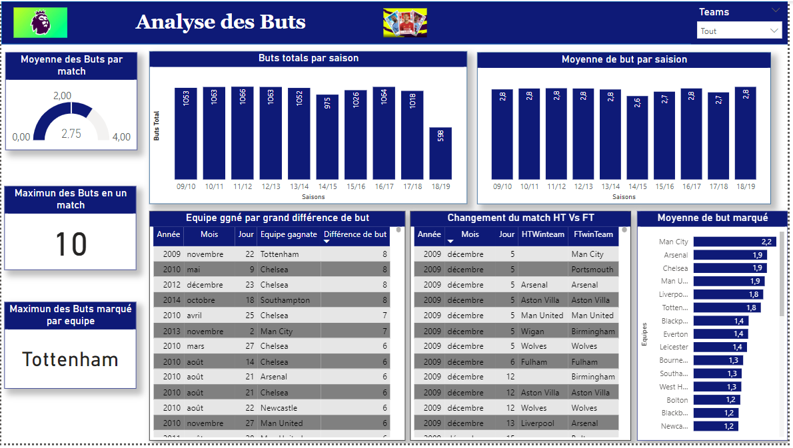

# PL-Analyses

## Overview
Il s'agit d'une analyse de données de la première league anglaise basé sur les performance des équipes, l'analyse des buts marquées et les performances des équipes les plus agréssives.

## Dataset:
Sur demande

## A propos du projet:

Cette analyse vise à examiner les performances des équipes de la Premier League anglaise entre 2009 et 2019, en utilisant Power BI pour visualiser les données. Les deux axes principaux de l'étude sont les performances globales des équipes et les statistiques de buts. 

Nous utiliserons des données historiques comprenant les résultats des matchs, les classements, le nombre de victoires, défaites, nuls, ainsi que les buts marqués et encaissés. De plus, nous analyserons les comportements d'agressivité des équipes à travers le nombre de fautes commises et de cartons reçus.

La méthodologie inclut la collecte de données à partir de sources fiables, le nettoyage des données pour en assurer l'intégrité, et la création de tableaux de bord interactifs dans Power BI pour visualiser les résultats. 

Les insights attendus permettront d'identifier les équipes les plus performantes, d'analyser les tendances de buts par saison, et de mettre en lumière les équipes les plus agressives. Cette étude fournira des informations précieuses aux fans, analystes sportifs, et dirigeants, tout en transformant des données complexes en visualisations claires et exploitables.

## Installation
Pour cette analyse nous avons installé l'outils d'analyse de données PowerBi Desktop

## Visualisation des rapport avec dataviz

  
  
  
  
  
